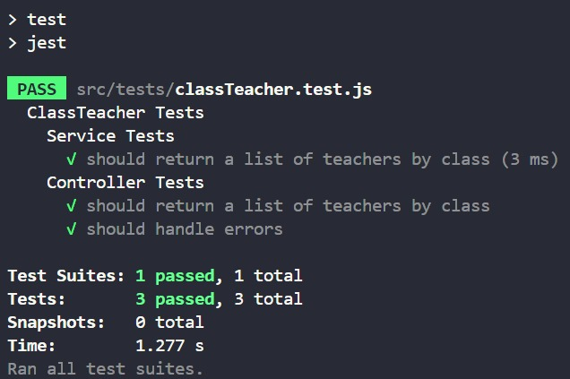

# Documentação de Testes Automatizados

## Introdução

Esta seção documenta os testes automatizados para as funcionalidades `ClassTeacherService` e `ClassTeacherController`. Os testes visam assegurar que as operações de consulta de professores por turma funcionem corretamente na API.

## Testes Implementados

### Service Tests

#### Teste 1: getAllTeachersByClass retorna lista de professores por turma

- *Objetivo:* Confirmar se o serviço retorna corretamente a lista de professores associados a uma turma.
- *Pré-condição:* Banco de dados contém registros de professores por turma.
- *Procedimento de Teste:* Invocar o método `getAllTeachersByClass` com um ID de turma válido.
- *Resultado Esperado:* Uma lista dos professores associados à turma fornecida é retornada.
- *Resultado Obtido:* Lista de professores retornada com sucesso em 3 ms.

### Controller Tests

#### Teste 2: getAllTeachersByClass responde à requisição GET corretamente

- *Objetivo:* Verificar se o controlador responde com a lista de professores quando a rota específica é acessada.
- *Pré-condição:* Rota `/classId/:fk_id_turma` é acessada com um ID de turma válido.
- *Procedimento de Teste:* Enviar uma requisição GET para a rota `/classId/:fk_id_turma`.
- *Resultado Esperado:* O controlador deve responder com a lista dos professores associados à turma indicada pelo ID.
- *Resultado Obtido:* Resposta correta da rota com a lista de professores.

#### Teste 3: getAllTeachersByClass trata erros adequadamente

- *Objetivo:* Garantir que o controlador lida com exceções de maneira adequada.
- *Pré-condição:* Uma falha é simulada durante a execução do serviço `getAllTeachersByClass`.
- *Procedimento de Teste:* Executar o controlador enquanto o serviço falha.
- *Resultado Esperado:* O controlador responde com status HTTP 500 e a mensagem de erro correspondente.
- *Resultado Obtido:* Manipulação adequada do erro com a resposta esperada.

## Executando os Testes

Para executar os testes, utilize o comando abaixo no terminal:

```bash
npm run test
```
## Conclusão
Os testes foram concluídos com êxito, com todos os cenários passando conforme esperado. Os resultados específicos são:

```bash
Test Suites: 1 passed
Tests: 3 passed
Time: 1.277s
```
O sucesso dos testes indica que as funcionalidades para consulta de professores por turma estão operando corretamente e os erros são tratados conforme o esperado.


Figura 1: Resultado dos Testes para ClassTeacher

<h6 align="center"> Figura 1: Resultado teste de classTeacher </h6>



<h6 align="center"> Fonte: Elaborado por Heitor Elias Prudente </h6>

